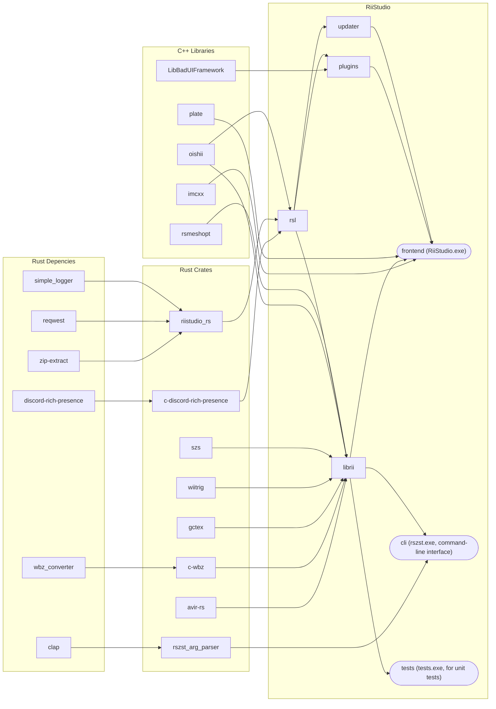
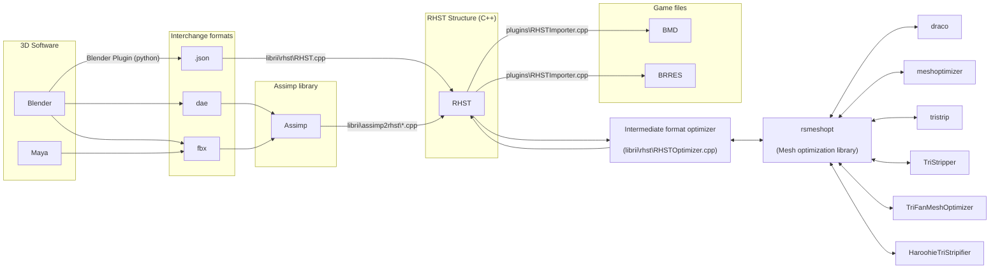

# source
An outline of the source tree.

All the folders in the [source](https://github.com/riidefi/RiiStudio/blob/master/source) directory are provided:

| Name                                                                                | Crate? | Description                                        | Programming Language |
|-------------------------------------------------------------------------------------|--------|----------------------------------------------------|----------------------|
| [avir-rs](https://github.com/riidefi/RiiStudio/blob/master/source/avir-rs)          | ✅ | Rust wrapper for a C++ image resizing library.         | Rust/C++             |
| [blender](https://github.com/riidefi/RiiStudio/blob/master/source/blender)          | ❌ | Blender plugin with exporter support for BRRES/BMD.    | Python               |
| [c-discord-rich-presence](https://github.com/riidefi/RiiStudio/blob/master/source/c-discord-rich-presence) | ✅ | C/C++ bindings for the [discord-rich-presence crate](https://github.com/sardonicism-04/discord-rich-presence). Provides an alternative to the official Discord libraries for RPC for C++ applications.                         | Rust                  |
| [c-wbz](https://github.com/riidefi/RiiStudio/blob/master/source/c-wbz)              | ✅ | C/C++ bindings for [wbz_converter](https://github.com/GnomedDev/wbz-to-szs-rs) | Rust |
| [cli](https://github.com/riidefi/RiiStudio/blob/master/source/cli)                  | ❌ | Source for the `rszst` utility.                         | C++, Rust            |
| [core](https://github.com/riidefi/RiiStudio/blob/master/source/core)                | ❌ | Core utilities and structures. Available to all other modules. | C++           |
| [frontend](https://github.com/riidefi/RiiStudio/blob/master/source/frontend)        | ❌ | The main editor itself.                                 | C++                  |
| [gctex](https://github.com/riidefi/RiiStudio/blob/master/source/gctex)              | ✅ | GC/Wii image codec. [Published to crates.io](https://crates.io/crates/gctex)   | Rust/C++          |
| [imcxx](https://github.com/riidefi/RiiStudio/blob/master/source/imcxx)              | ❌ | My C++ wrappers for ImGui.                              | C++                  |
| [LibBadUIFramework](https://github.com/riidefi/RiiStudio/blob/master/source/LibBadUIFramework) | ❌ | Basis of the `plugins` folder, defines some extendable UI structures. |  C++   |
| [librii](https://github.com/riidefi/RiiStudio/blob/master/source/librii)            | ❌ | Library for interacting with Wii data. [Documentation here](https://github.com/riidefi/RiiStudio/blob/master/source/librii/README.md)                 | C++                  |
| [llvm](https://github.com/riidefi/RiiStudio/blob/master/source/llvm)                | ✅ | Rust wrapper for the llvm crash handler.                | Rust/C++             |
| [oishii](https://github.com/riidefi/RiiStudio/blob/master/source/oishii)            | ❌ | My binary IO library.                                   | C++                  |
| [plate](https://github.com/riidefi/RiiStudio/blob/master/source/plate)              | ❌ | Dear ImGui boilerplate code.                            | C++                  |
| [plugins](https://github.com/riidefi/RiiStudio/blob/master/source/plugins)          | ❌ | Specific plugins for the editor: BMD, BRRES, Assimp (to BMD/BRRES). | C++      |
| [rsl](https://github.com/riidefi/RiiStudio/blob/master/source/rsl)                  | ❌ | My standard library: generic template types.            | C++                  |
| [rsmeshopt](https://github.com/riidefi/RiiStudio/blob/master/source/rsmeshopt)      | ❌ | My mesh optimization library.                           | C++                  |
| [rust_bundle](https://github.com/riidefi/RiiStudio/blob/master/source/rust_bundle)  | ✅ | Allows RiiStudio to be `cargo bundle`d into a MacOS .app file. | Rust          |
| [szs](https://github.com/riidefi/RiiStudio/blob/master/source/szs)                  | ✅ | SZS compressing and decompressing algorithms. [Published to crates.io](https://crates.io/crates/szs) | Rust/C++          |
| [tests](https://github.com/riidefi/RiiStudio/blob/master/source/tests)              | ❌ | A CLI tool used by the python unit tests.               | C++                  |
| [updater](https://github.com/riidefi/RiiStudio/blob/master/source/updater)          | ❌ | Application updater                                     | C++                  |
| [vendor](https://github.com/riidefi/RiiStudio/blob/master/source/vendor)            | ❌ | Third-party code.                                       | C, C++               |
| [wiitrig](https://github.com/riidefi/RiiStudio/blob/master/source/wiitrig)          | ✅ | Wii `sin`/`cos` function implementations                | Rust/C++             |

Dependencies between these packages are listed in the following flowchart. Generally, `librii` handles file formats/Wii-specifics while `plugins` provides a higher level interface for the editor. The two main .exe files are `frontend` (RiiStudio.exe) and `cli` (rszst.exe).

### Data pipeline for model creation
The following flowchart explains how 3d model data comes in (from Blender, as a .dae/.fbx file) and eventually ends up as a .brres or .bmd file (with model optimizations).

