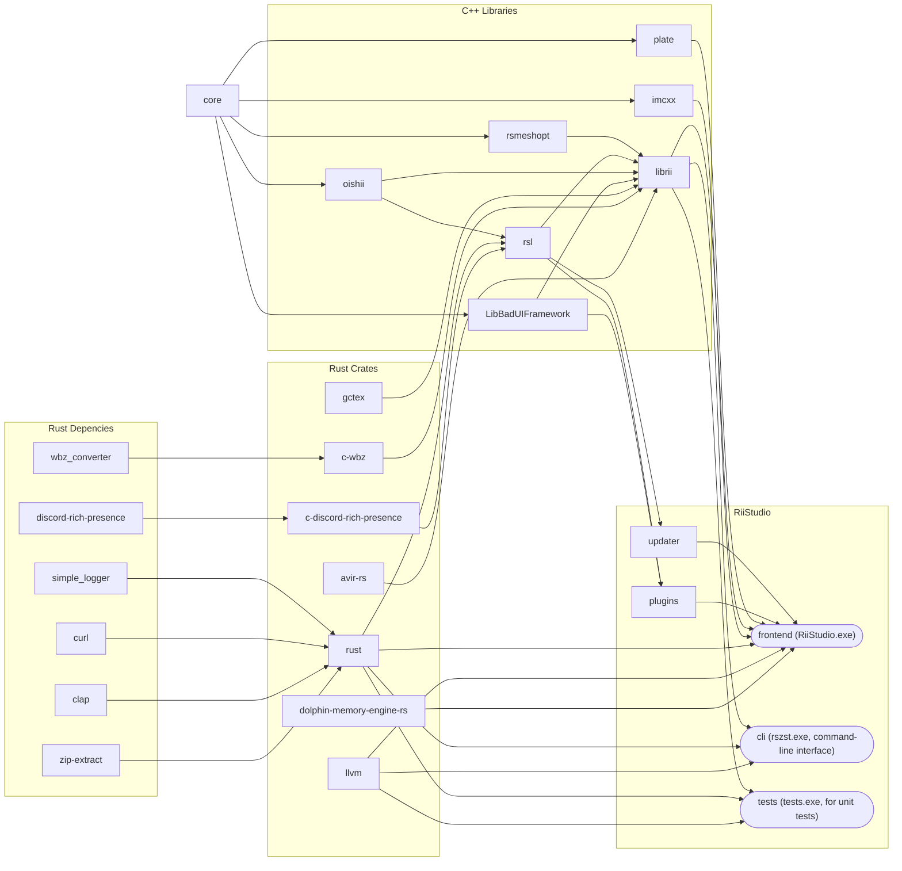
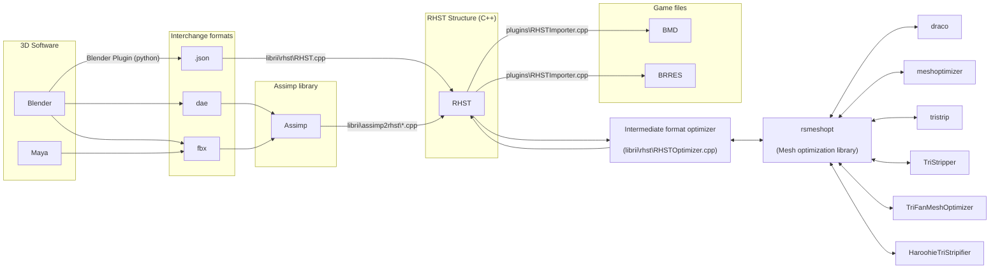

# source
An outline of the source tree.

### Data pipeline for model creation

## avir-rs
Rust wrapper for a C++ image resizing library.

## blender
Blender plugin with exporter support for BRRES/BMD.

## cli
Source for the `rszst` utility.

## core
Core utilities and structures. Available to all other modules.

## frontend
The main editor itself.

## gctex
GC/Wii image codec. https://crates.io/crates/gctex

## imcxx
My C++ wrappers for ImGui.

## LibBadUIFramework
Basis of the `plugins` folder, defines some extendable UI structures.

## librii
Library for interacting with Wii data.

## llvm
Rust wrapper for the llvm crash handler.

## oishii
My binary IO library.

## plate
Dear ImGui boilerplate code.

## plugins
Specific plugins for the editor.
- BMD
- BRRES
- KMP
- BFG
- BLIGHT
- BLMAP
- Assimp (to BMD/BRRES)

## rsl
My standard library: generic template types.

## rsmeshopt
My mesh optimization library.

## rust
Rust code other modules can depend on

## rust_bundle
Allows RiiStudio to be `cargo bundle`d into a MacOS .app file.

## scripts
Once housed scripts for generating format Node files. Now just has a CMAKE config for targetting the Wii itself.

## tests
A CLI tool used by the python unit tests.

## updater
Application updater

## vendor
Third-party code.
