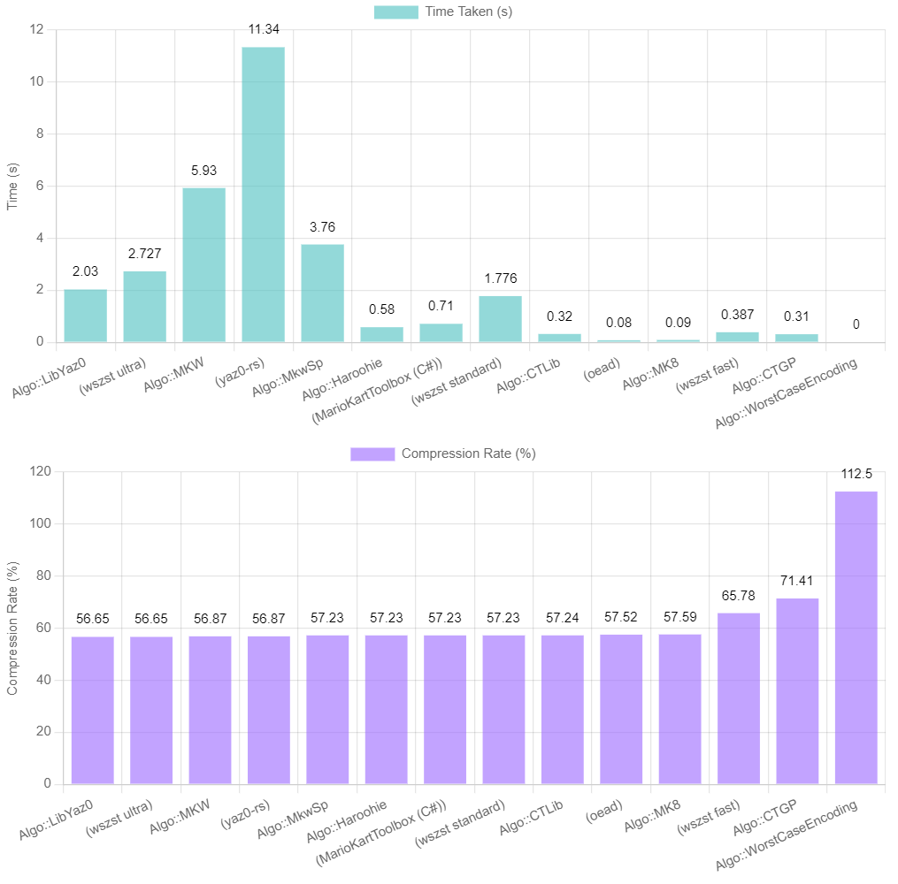
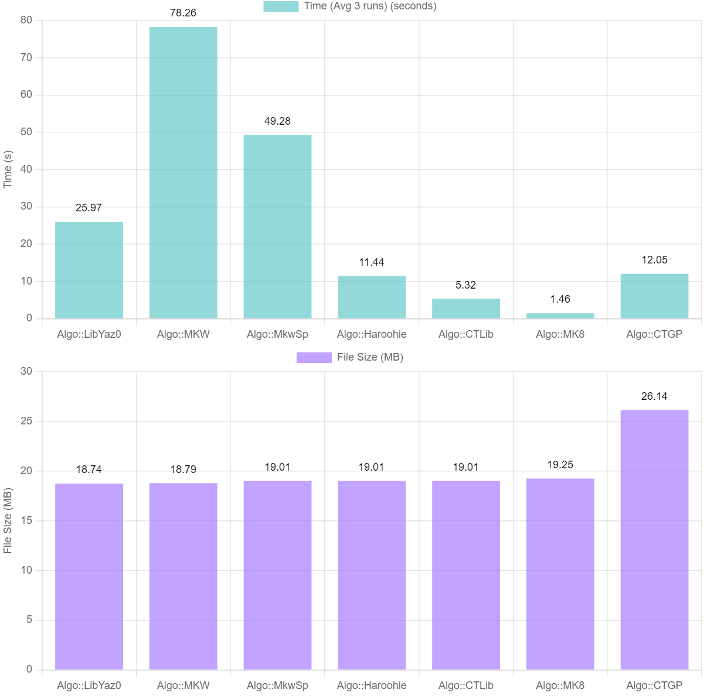

[](https://crates.io/crates/szs)
[](https://docs.rs/szs/)

# `szs`
Lightweight crate for SZS (\"Yaz0\") compression/decompression used in the Nintendo GameCube/Wii games. The library provides [C](https://github.com/riidefi/RiiStudio/tree/master/source/szs#example-c-bindings), [C++](https://github.com/riidefi/RiiStudio/tree/master/source/szs/c%2b%2b), [C#](https://github.com/riidefi/RiiStudio/tree/master/source/szs/c%23), and [WIP Python](https://github.com/riidefi/RiiStudio/tree/master/source/szs/py) bindings. YAY0 ("SZP") is supported, too.

### Rust
The following snippet demonstrates how to compress a file as a SZS format using Rust:

```rs
let src_data: Vec<u8> = "Hello, World!".as_bytes().to_vec();

match szs::encode(&src_data, szs::EncodeAlgo::Nintendo) {
    Ok(encoded_data) => {
        println!("Encoded into {} bytes", encoded_data.len());
    }
    Err(err) => {
        println!("Encoding failed: {}", err);
    }
}
```
And similarly, to decompress:
```rs
match szs::decode(&encoded_data) {
    Ok(decoded_data) => {
        println!("Decoded {} bytes", decoded_data.len());
    }
    Err(err) => {
        println!("Decoding failed: {}", err);
    }
}
```

## C# Bindings
The following C# bindings are [provided](https://github.com/riidefi/RiiStudio/tree/master/source/szs/c%23):
```cs
public static void Main(string[] args)
{
    byte[] data = ...;
    szs.CompressionAlgorithm algorithm = szs.CompressionAlgorithm.Nintendo;
    try
    {
        byte[] encodedData = szs.Encode(data, algorithm);
        Console.WriteLine($"Encoded {encodedData.Length} bytes.");
    }
    catch (Exception e)
    {
        Console.WriteLine("Failed to compress: " + e.Message);
    }
}
```

##### Warning: `szs` has a portion implemented in C, which brings its own security considerations.

### Algorithms

| Algorithm                       | Use Case                 | Desc               |
|---------------------------------|--------------------------|--------------------|
| `EncodeAlgo::Nintendo`          | Matching decomp projects | This is the Mario Kart Wii compression algorithm reverse-engineered. In practice it's a Boyer-moore-horspool search with a second opinion mechanism. |
| `EncodeAlgo::Mk8`               | General `FAST` preset.   | This is the Mario Kart 8 compression algorithm reverse-engineered. In practice it's a sliding Monte Carlo hash table. (Credit @aboood40091, @KillZGaming) |
| `EncodeAlgo::MkwSp`             |                          | MKW-SP |
| `EncodeAlgo::CTGP`              | CTGP work                | CTGP (Reverse engineered. 1:1 matching) |
| `EncodeAlgo::WorstCaseEncoding` | `INSTANT` preset.        | Worst case |
| `EncodeAlgo::Haroohie`          |                          | Haroohie (credit @Gericom, adapted from MarioKartToolbox) |
| `EncodeAlgo::CTLib`             |                          | CTLib (credit @narahiero, adapted from CTLib) |
| `EncodeAlgo::LibYaz0`           | `ULTRA` preset.          | libyaz0 (Based on wszst. credit @aboood40091) |

Generally, the `mk8` algorithm gets acceptable compression the fastest. For cases where filesize matters, `lib-yaz0` ties `wszst ultra` for the smallest filesizes, while being ~25% faster.

### Comparison to Other Libraries:
1. **[yaz0-rs](https://github.com/gcnhax/yaz0-rs)**
    - Performance: `EncodeAlgo::LibYaz0` offers superior compression and is approximately 6x faster on reference data compared to `yaz0-rs`.
    - Note: `szs` has a portion implemented in C, which brings its own security considerations.

2. **[oead](https://github.com/zeldamods/oead)**
    - Performance: `EncodeAlgo::MK8` matches the compression and speed of `oead`.
    - Size: `szs` is a lightweight few-kilobyte MIT licensed dependency, while `oead` is a larger multi-megabyte GPL licensed package.

3. **[Wiimm's SZS Tools](https://github.com/Wiimm/wiimms-szs-tools)**
    - Performance:
        - `EncodeAlgo::LibYaz0` provides equivalent compression to `wszst ultra` but is about 30% faster and not restricted by the GPL license.
        - `EncodeAlgo::MK8` outperforms `wszst fast` in compression and is 4-5 times faster.

**Special Feature**: Among the libraries listed, only `szs` offers comprehensive support for the `YAZ0`, `YAZ1`, and `YAY0` stream formats.

### Benchmarks


#### Large file comparison
NSMBU 8-43 (63.9 MB decompressed)
| Method              | Time (Avg 3 runs) | Compression Rate | File Size |
|---------------------|-------------------|------------------|-----------|
| worst-case-encoding |             0.03s |          112.50% |  71.90 MB |
| mk8                 |             1.37s |           29.43% |  18.81 MB |
| ct-lib              |             3.01s |           29.74% |  19.01 MB |
| haroohie            |             5.79s |           29.74% |  19.01 MB |
| ctgp                |             9.23s |           40.91% |  26.14 MB |
| lib-yaz0            |            16.09s |           29.32% |  18.74 MB |
| mkw-sp              |            36.77s |           29.74% |  19.01 MB |
| mkw                 |            55.00s |           29.40% |  18.79 MB |
| mkw (C++)           |            63.34s |           29.40% |  18.79 MB |
| **Comparison with other libraries:** |    |                  |           |
| oead default        |         **0.61s** |           30.09% | 19.23 MB  |
| oead max level      |             0.99s |           29.96% | 19.15 MB  |
| wszst fast          |             1.77s |           35.62% | 22.76 MB  |
| wszst standard      |            11.95s |           29.74% | 19.01 MB  |
| wszst ultra         |            25.06s |       **29.32%** | **18.74 MB**  |


*\* Average of 3 runs; x64 Clang (17.0.6) build tested on an Intel i9-13900KF on Windows 11*

#### Small file comparison
**Task: Compress N64 Bowser Castle** (Source filesize: 2,574,368)
| Method              | Time (Avg 3 runs) | Compression Rate | File Size |
|---------------------|-------------------|------------------|-----------|
| worst-case-encoding |         **0.00s** |          112.50% |   2.76 MB |
| mk8                 |             0.07s |           56.75% |   1.39 MB |
| ct-lib              |             0.19s |           57.24% |   1.41 MB |
| ctgp                |             0.21s |           71.41% |   1.75 MB |
| haroohie            |             0.31s |           57.23% |   1.41 MB |
| lib-yaz0            |             1.09s |       **56.65%** |**1.39 MB**|
| mkw-sp              |             1.47s |           57.23% |   1.41 MB |
| mkw                 |             3.91s |           56.87% |   1.40 MB |
| mkw (C++)           |             4.27s |           56.87% |   1.40 MB |
| **Comparison with other libraries:** |       |                  | |
| oead default        |         **0.03s** |           57.63% |   1.41 MB |
| oead max level      |             0.05s |           57.52% |   1.41 MB |
| wszst (fast)        | 0.197s (via shell)|           65.78% | 1.61MB |
| wszst (standard)    | 0.946 (via shell) |         57.23%   | 1.40MB |
| wszst (ultra)       | 1.418s (via shell)|       **56.65%** | 1.38MB |
| yaz0-rs             | 4.88s (via shell) |           56.87% | 1.39MB |

*\* Average of 3 runs; x64 Clang (17.0.6) build tested on an Intel i9-13900KF on Windows 11*


Generally, the `mk8` algorithm gets acceptable compression the fastest. For cases where filesize matters, `lib-yaz0` ties `wszst ultra` for the smallest filesizes, while being ~25% faster.




### (Windows) Performance Comparison: Clang vs. MSVC

On Windows, Microsoft's compiler (MSVC) appears to fall behind [Clang](https://releases.llvm.org/download.html) for most algorithms by a non-trivial margin:

| Method     | Clang Time (s) | MSVC Time (s) | Performance Uplift (%) |
|------------|----------------|---------------|------------------------|
| lib-yaz0   | 15.24          | 19.08         | -25.20%                |
| mkw        | 62.04          | 58.34         | 5.96%                  |
| mkw-sp     | 26.73          | 50.01         | -87.09%                |
| haroohie   | 5.84           | 5.85          | -0.17%                 |
| ct-lib     | 2.91           | 2.81          | 3.44%                  |
| mk8        | 1.34           | 1.62          | -20.90%                |
| ctgp       | 5.22           | 5.88          | -12.64%                |

*\* Average of 3 runs; x64 MSVC build tested on an Intel i9-13900KF on Windows 11*

**Average Performance Uplift:** -19.51%

#### Recommendation

Based on the performance results, Clang is generally preferred. To set Clang as the compiler for `szs`, run the following command before `cargo build`:

```sh
SET CXX=clang
```

Additionally, using a compatible Clang/Rust version will allow for cross-language LTO optimizations.

### Example (C Bindings)
```c
#include "szs.h"

// Calculate the upper bound for encoding.
u32 max_size = riiszs_encoded_upper_bound(sizeof(data));

// Allocate a buffer based on the calculated upper bound.
void* encoded_buf = malloc(max_size);
if (!buf) {
	fprintf(stderr, "Failed to allocate %u bytes.\n", max_size);
	return -1;
}

// Boyer-Moore-horspool variant
u32 algorithm = RII_SZS_ENCODE_ALGO_NINTENDO;

u32 actual_len = 0;
const char* ec = riiszs_encode_algo_fast(encoded_buf, max_size, data, sizeof(data), &actual_len, algorithm);
if (ec != NULL) {
	fprintf(stderr, "Failed to compress: %s\n", ec);
	riiszs_free_error_message(ec);
	return -1;
}
printf("Encoded %u bytes.\n", actual_len);
// Optionally: shrink the dst_data to the actual size.
encoded_buf = realloc(encoded_buf, actual_len);
```

### C++ Wrapper on top of C Bindings
#### [A CMake example is provided, too.](https://github.com/riidefi/RiiStudio/tree/master/source/szs/c%2b%2b)
```cpp
#include `szs.h`

// Boyer-Moore-horspool variant
szs::Algo algorithm = szs::Algo::Nintendo;
auto encoded = szs::encode(data, algorithm);
if (!encoded)
	std::println(stderr, "Failed to compress: {}.", encoded.error()); {
	return -1;
}
std::vector<u8> szs_data = *encoded;
std::println("Encoded {} bytes.", szs_data.size());
```

#### License
This library is published under the MIT license.
